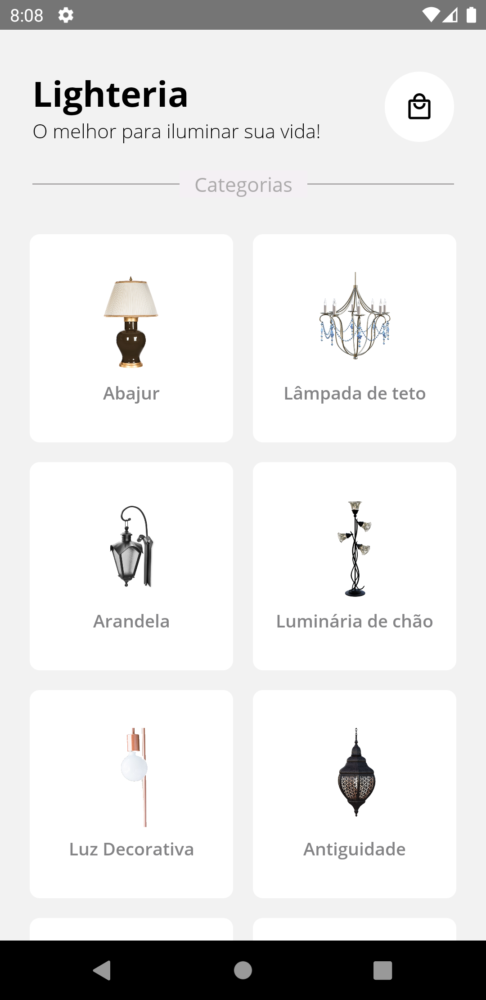
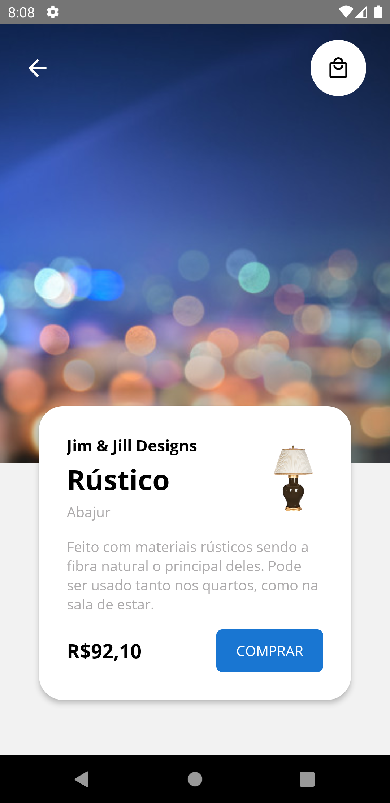
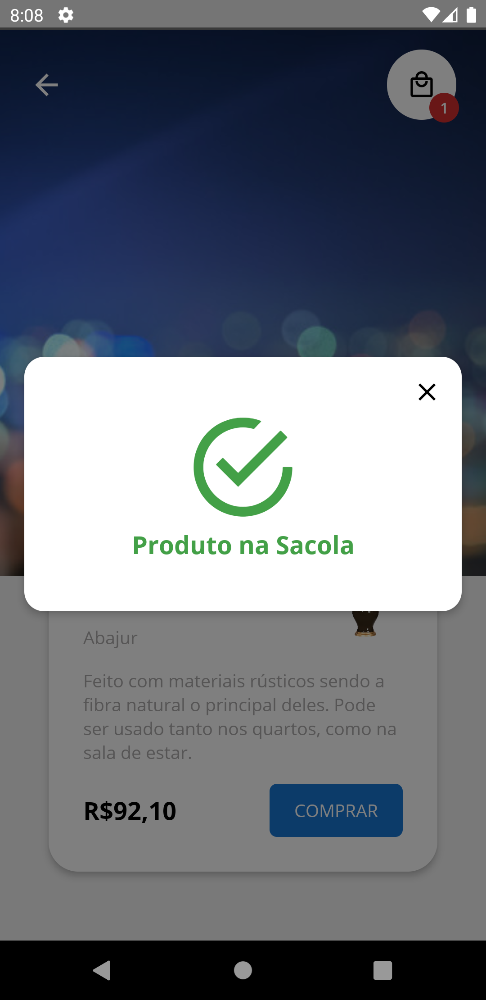
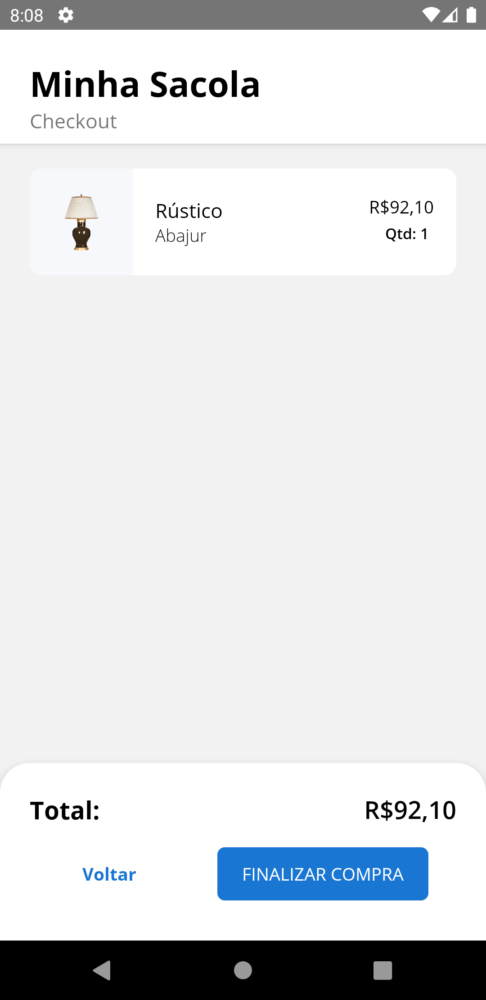
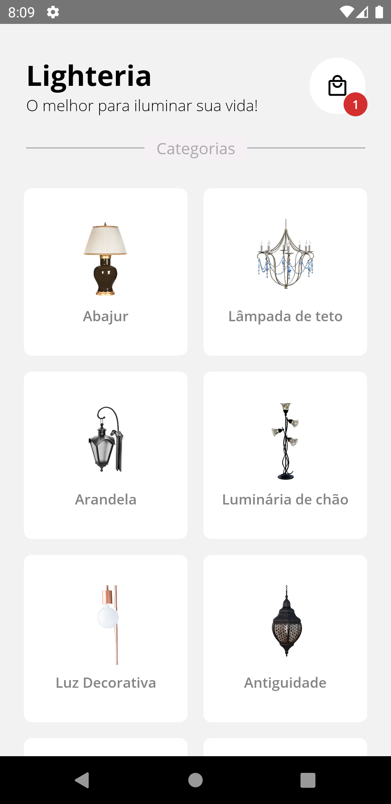
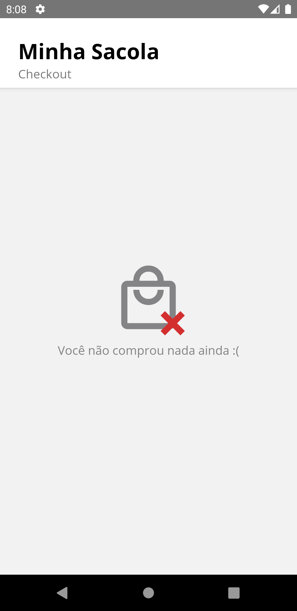

# Lighteria - React Native
[](#) 
[](https://github.com/duduCMT/React-Native-CRUD-Redux/blob/master/LICENSE) 
## 📸 Preview

<p align="center">
  
</p>

## 📝 **Descrição**

A Lighteria é uma loja de Lâmpadas, Luzes e Luminárias decorativas para o seu ambiente. Com base nessa ideia, foi criado um aplicativo usando React Native para inicial o seu e-commerce. 

## 🚀 **Objetivo**

Esse projeto foi criado com o objetivo de criar um aplicativo simples que simula uma loja de lâmpadas, luzes e luminárias no geral. Possuindo as funções de exibição, seleção dos itens no carrinho (Sacola) e finalização da compra. Apesar de simples, o projeto cumpre o seu papel de explorar novas formas de design de apps e as principais features da [ContextAPI](https://pt-br.reactjs.org/docs/context.html) e do [React Navigation](https://reactnavigation.org/docs/getting-started/). Além disso, foi explorado os componentes da biblioteca [react-native-vector-icons](https://github.com/oblador/react-native-vector-icons) para exibição dos ícones.

## 📌 Nota importante!
Esse app foi baseado no layout do projeto do curso "React Native: Design System no seu app" da Alura. Porém, o projeto original está incompleto e não funcional. Você pode conferir o repositório disponibilizado pela Alura [neste link](https://github.com/alura-cursos/CursoLayoutReactNativeAulas/tree/master). Ou seja, o projeto desse repositório atual é uma versão melhorada e completa da ideia inicial da Lighteria proposta pela Alura. Com mais features, libs extras e boas prática, além de possuir alguns toques especiais meus.

As imagens utilizadas no projeto foram disponibilizados gratuitamente pelo site [Pixabay](https://pixabay.com/pt/). As informações mockadas do projeto são meramente ilustrativas.

## ✅ Features Funcionais
- Exibição dos produtos disponíveis na Lighteria
- Exibição dos detalhes dos produtos selecionados
- Preview com mais detalhes da imagem do produto selecionado
- Adição dos produtos comprados na sacola
- Exibição e atualização dinâmica da quantidade de itens na sacola
- Exibição do valor total da compra na sacola
- Finalização da compra limpando a sacola

## 📎 Exemplo da estrutura de Dados
```javascript
  {
    id: '1',
    titulo: 'Abajur',
    imagem: require('../assets/images/01-abajur.png'),
    estudio: 'Jim & Jill Designs',
    itemName: 'Rústico',
    preco: 92.1,
    itemDesc:
      'Feito com materiais rústicos sendo a fibra natural o principal deles. Pode ser usado tanto nos quartos, como na sala de estar.',
  }
````


## 🔎 Teste Você Mesmo
📌 **Pré requisitos:**
1. Tenha o repositório baixado em sua máquina.
2. Tenha o [NodeJS](https://nodejs.org/) instalado em sua máquina
3. Tenha o [React Native CLI](https://reactnative.dev/docs/environment-setup) instalado em sua máquina junto a um virtual device Android ou iOS.

🚩 **Como Executar:**
1. Com o terminal aberto no diretório do projeto, execute o comando `npm install` para instalar as dependências.
2. Para executar o projeto você deve seguir os passos mostrados na documentação do [React Native CLI](https://reactnative.dev/docs/environment-setup). Dependendo do seu sistema operacional e plataforma de execução você deve usar comandos diferentes.
3. Caso você queira testar no Windows usando um virtual device Android execute o comando: ` npx react-native run-android `. Em outro caso, consulte a documentação no item 1.

## 📸 Preview das Telas

<p align="center">
  
  
  
  
  
  
</p>
   


